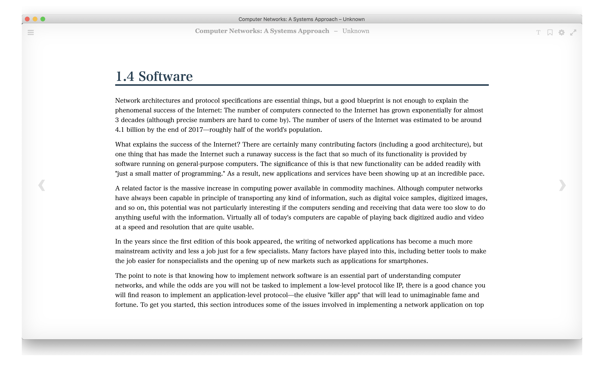

# mu-epub-reader

Epub viewer on Electron.

This application is forked of [futurepress/epubjs-reader: Epub.js Reader](https://github.com/futurepress/epubjs-reader).

## Features

- Standalone Electron app
- Integrate with Google Translation
- Shortcuts: 
    - <kbd>←</kbd>: Prev Page
    - <kbd>→</kbd>: Next Page
    - <kbd>j</kbd> or <kbd>Space</kbd>: Scroll down
    - <kbd>k</kbd> or <kbd>Shift+Space</kbd>: Scroll up
    - <kbd>Cmd+o</kbd>: Open file
    - <kbd>Cmd+^</kbd>: Increase font size
    - <kbd>Cmd+-</kbd>: Decrease font size
    - <kbd>Cmd+0</kbd>: Reset font size
- One column mode: continuous scroll like PDF
- Open file with arguments




> Quote from <https://book.systemsapproach.org/>

## Usage

1. Click *File* > *Open File* 
2. Select epub file
3. View epub


or

1. Open epub file with mu-epub-reader
2. View epub

## Installation

**Electron Version**:

Download app and Install it.

- [Download binary from Latest Release](https://github.com/azu/mu-epub-reader/releases/latest)

:warning: This app is not signed. So, it will appear warning about un-signed app.

**Web Version**:

- <https://mu-epub-reader.netlify.com/?bookPath=https://mu-epub-reader.netlify.com/example/childrens-literature.epub>
    - :warning: Require CORS setting for each epub files
    - :memo: Source: https://github.com/IDPF/epub3-samples/tree/master/30/childrens-literature/EPUB

## Development

Build electron app

    yarn install
    yarn run dist
    # output .app to dist/

Load `reader/override.js` or [`<AppData>/mu-epub-viewer/override.js`](https://electronjs.org/docs/all#appgetpathname) if exists.

```
- macOS: ~/Library/Application Support/mu-epub-viewer/override.js
```

1. Put custom logic script to `reader/override.js`
2. Restart app
3. mu-epub-reader preload `reader/override.js` in renderer process.

`override.js` example: modify request url

```js
const origOpen = XMLHttpRequest.prototype.open;
XMLHttpRequest.prototype.open = function (...args) {
    const originalURL = args[1];
    const url = new URL(originalURL);
    /// hack something...
    args[1] = url.toString();
    origOpen.apply(this, args);
};
```

## Related

- [azu/mu-pdf-viewer: PDF viewer on electron.](https://github.com/azu/mu-pdf-viewer)
    - PDF Viewer
- [Epub.js](http://futurepress.github.com/epub.js/) library


## Contributing

1. Fork it!
2. Create your feature branch: `git checkout -b my-new-feature`
3. Commit your changes: `git commit -am 'Add some feature'`
4. Push to the branch: `git push origin my-new-feature`
5. Submit a pull request :D

## License

MIT
